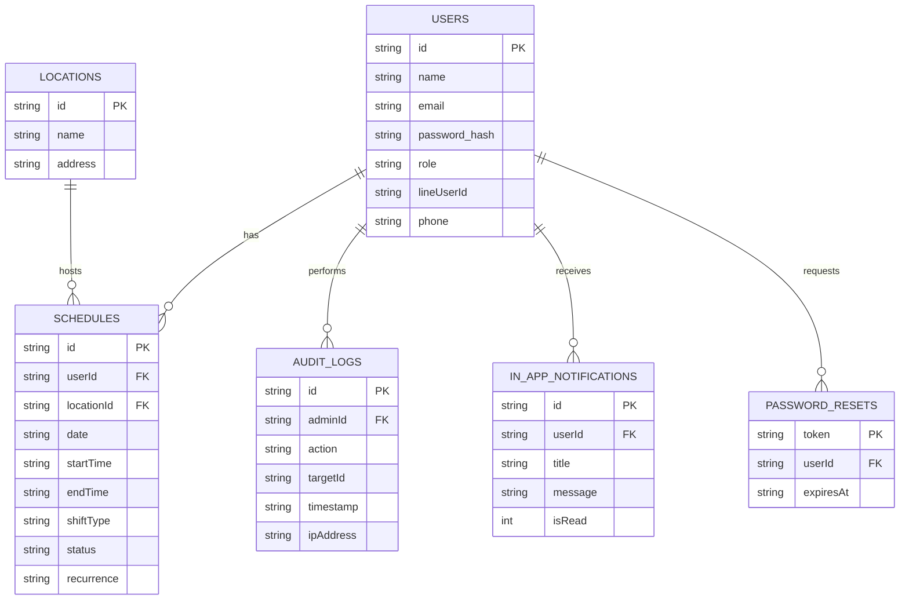

# Enterprise Sales Schedule System

A comprehensive, full-stack scheduling and management application built for enterprise sales teams. This application provides real-time shift management, detailed analytics, an audit trail, and robust role-based access control.

## Screenshots
*(Add screenshots here)*

## Architecture

This application follows a modern client-server architecture:
- **Frontend**: React (Vite) + React Router + Vanilla CSS (Custom Design System). Deployed as a Progressive Web App (PWA) with offline caching.
- **Backend**: Node.js + Express.js + SQLite (Turso Cloud Database).
- **Security**: JWT Authentication, bcrypt password hashing, Helmet headers, and IP Rate Limiting.

### Database ER Diagram


## Features
- **Master Calendar**: Drag-and-drop scheduling, shift templates, location filters.
- **Draft & Publish**: Save schedules as drafts before publishing.
- **Soft Deletes**: Accidentally deleted a shift? Click "Undo" in the toast notification to restore it instantly!
- **KPI Dashboard**: Real-time stats on team coverage and published/draft shifts.
- **Audit Logs**: Every create, update, and delete action is tracked with the Admin's ID and IP address.
- **Notification Center**: Global notification bell for in-app alerts.
- **Exporting**: Export schedules to CSV or `.ics` (Google Calendar Sync).
- **Recurring Schedules**: Set shifts to repeat weekly or monthly.
- **Offline Mode**: A built-in Service Worker caches the app shell and API requests for offline viewing.

## User Roles
1. **Admin**: Has full access to the Master Calendar, Employee Directory, KPI Analytics, and Audit Logs. Can create, edit, publish, and delete schedules.
2. **Sales**: Has access to their personal dashboard. Can view their upcoming shifts, Check-in, and Mark shifts as Completed.

## API Documentation

### Auth & Security
- `POST /api/login`: Authenticate and receive JWT (Rate limited: 5 requests / 15 mins).
- `POST /api/forgot-password`: Request a password reset link.
- `POST /api/reset-password`: Submit a new password with a valid token.

### Schedules
- `GET /api/schedules`: Fetch all active (non-deleted) schedules.
- `POST /api/schedules`: Create new schedules (supports `recurrence` and conflict prevention).
- `PUT /api/schedules/:id`: Update a schedule (e.g., Publish a draft).
- `DELETE /api/schedules/:id`: Soft delete a schedule.

### Timeline & Activity
- `POST /api/schedules/:id/acknowledge`: Sales rep acknowledges a shift.
- `POST /api/schedules/:id/checkin`: Sales rep checks in at the location.
- `POST /api/schedules/:id/complete`: Sales rep completes the shift.

### Analytics & System
- `GET /api/analytics/kpi`: Fetch dashboard KPIs.
- `GET /api/audit-logs`: Fetch the recent 100 audit logs.
- `GET /api/notifications/in-app`: Fetch unread notifications.

## Local Setup

1. **Install Dependencies**
   ```bash
   npm install
   ```

2. **Environment Variables**
   Create a `.env` file in the root directory:
   ```env
   JWT_SECRET=your_super_secret_key
   TURSO_DATABASE_URL=your_turso_url
   TURSO_AUTH_TOKEN=your_turso_token
   ```

3. **Run Development Server**
   ```bash
   npm run dev
   ```
   *Note: This runs concurrently. The frontend runs on port 5173, and the backend API runs on port 3001.*

4. **Build for Production**
   ```bash
   npm run build
   ```
